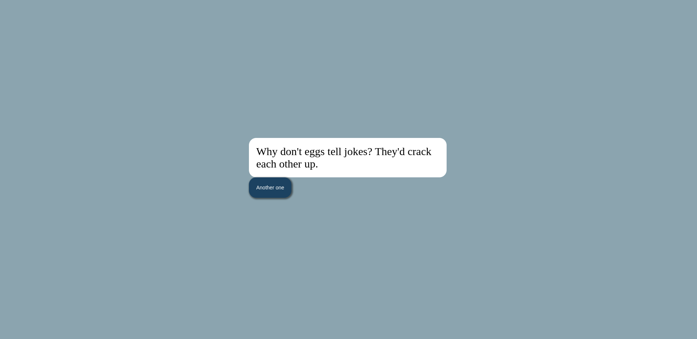

# Dad-jokes-generator using JS

Today I wanted to quickly revise few JS concepts I have learned and created this dad jokes generator. 

Here's the link to the project:

[Codes written](https://github.com/Sareeka61/Dad-jokes-generator/tree/main)

[Deployed webapp](https://tell-me-a-dad-joke.netlify.app/) : https://tell-me-a-dad-joke.netlify.app/

