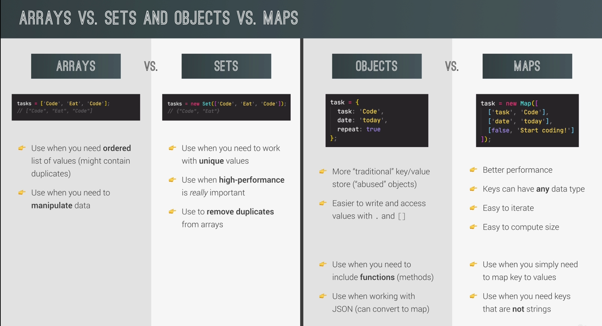

# Which data structure do I choose?

We will be focusing on array, sets, objects and maps while discussing this. 

Firstly, when you would like to make a simple lists, use arrays or sets. Secondly, if you want key-value pair, use objects or maps.

**In detail:**

The below mentioned are the points to make efficient and best choices while choosing the Data Structure when you code in JS.

### Arrays:

- Use arrays when you need an ordered collection of elements that you want to access by index.

- Arrays provide fast access to elements using their index, making them suitable for operations such as searching, sorting, and iteration.

- They are mutable, meaning you can easily modify elements at specific indices.

- Arrays are not efficient for operations that involve frequent insertion or deletion of elements at the beginning or middle, as it requires shifting the existing elements.

### Objects:

- Use objects when you need an unordered collection of key-value pairs and fast access to values using their keys.

- Objects are highly efficient for key-based lookups, making them suitable for scenarios like dictionaries or when you need to associate metadata with an entity.

- They are not ordered, so if you require ordered iteration or sorting, objects may not be the best choice.

- Objects can be modified easily, allowing for efficient addition and removal of key-value pairs.

### Maps:

- Use maps when you need a collection of key-value pairs with reliable insertion order and efficient key-based operations.

- Maps provide better performance for frequent additions and removals of elements compared to arrays and objects.

- They maintain the order of elements based on the insertion sequence, making them suitable for scenarios that require iteration in a specific order.

- Maps are iterable and offer various utility methods for working with their contents.

### Sets:

- Use sets when you need a collection of unique values with no specific order.

- Sets are useful when you want to store a collection of items and efficiently check for the presence of a particular value.

- They automatically enforce uniqueness, meaning you don't need to worry about duplicate values.

- Sets are particularly efficient for membership testing and eliminating duplicates from arrays.

*Note: JavaScript also offers other specialized data structures like WeakMap, WeakSet, and more. These cater to specific use cases, such as handling weak references or storing objects as keys.*