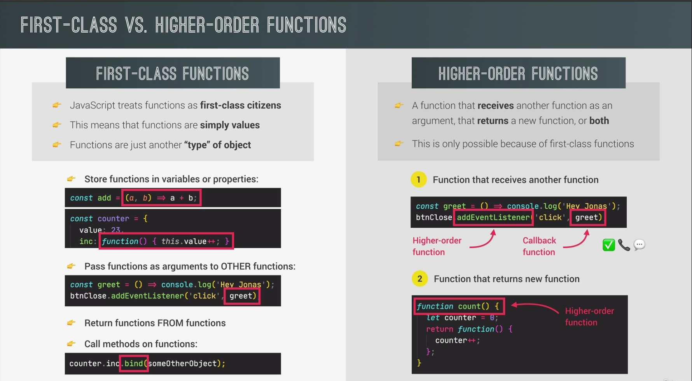

# First-Class Functions Vs. Higher-Order Functions

## First-Class Functions:

- First-class functions refer to the concept of treating functions as first-class citizens in a programming language.

- In JavaScript, functions are first-class entities, which means they can be assigned to variables, passed as arguments to other functions, and returned as values from functions.

- This enables functions to be used and manipulated just like any other data type, such as numbers or strings.

- Functions can be stored in variables, arrays, or objects, allowing for dynamic and flexible programming.

- First-class functions are essential for implementing higher-order functions in JavaScript.

## Higher-Order Functions:

- Higher-order functions are functions that operate on other functions by taking them as arguments or returning them as results.

- In JavaScript, higher-order functions are made possible due to the language's support for first-class functions.

- Higher-order functions can accept functions as parameters, allowing them to perform operations on those functions or use them in some way.

- They can also return functions as results, providing the ability to generate and customize functions on the fly.

- Higher-order functions enable powerful functional programming techniques in JavaScript, such as function composition, currying, and callbacks.
