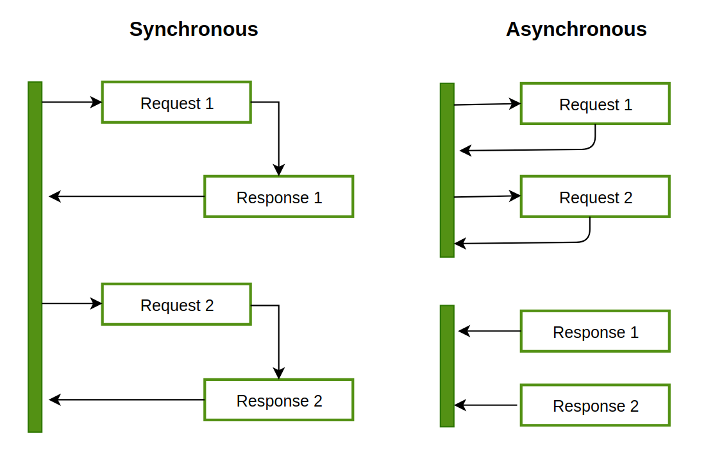

# Asynchronous Programming in JS

- Asynchronous programming allows a program to start a long-running task and remain responsive to other events while the task is running.

- Functions that can potentially take a long time, such as making HTTP requests, accessing a user's camera or microphone, or selecting files, are typically asynchronous.

- While synchronous programming executes code line by line, waiting for each line to finish before proceeding, asynchronous programming allows functions to start an operation and return immediately, enabling the program to respond to other events.

- Long-running synchronous functions can cause the program to become unresponsive, preventing users from interacting with it until the function completes.

- Asynchronous functions, on the other hand, allow programs to start operations, continue running, and be notified of the results when the operations finish.

- Event handlers are a form of asynchronous programming where functions are called in response to specific events. They can be used to implement asynchronous functionality, like handling the completion of an asynchronous operation.

- Callbacks are functions passed into other functions, which are called at the appropriate time. They were commonly used for implementing asynchronous functions but can lead to callback hell, with deeply nested and hard-to-read code.

- Modern asynchronous programming in JavaScript is often based on Promises, which provide a more structured and readable way to handle asynchronous operations.