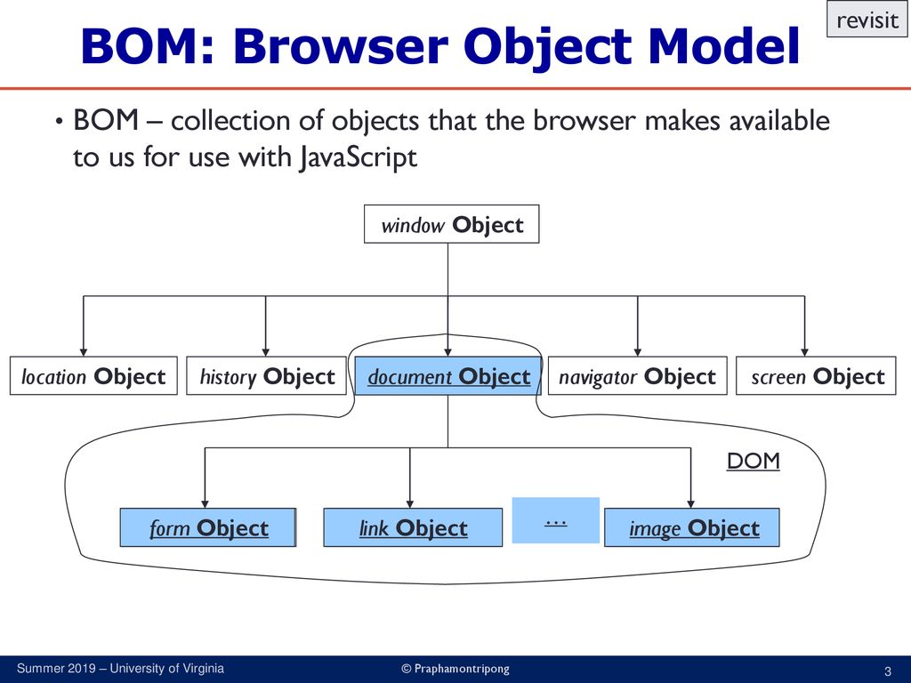
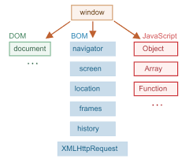

# Browser Object Model

In JavaScript, "BOM" stands for "Browser Object Model." The Browser Object Model is a collection of JavaScript objects provided by web browsers to interact with and manipulate the web browser window and its components, such as the document, history, location, and navigator.

### BOM vs. DOM
The main difference between the BOM and DOM is that the BOM represents the browser and its components, while the DOM represents the structured content of a web page.



### Commonly Used BOM


Here are some commonly used objects in the BOM:

```window``` The global object representing the current browser window or tab. It provides access to various properties and methods related to the window, including manipulating the browser's dimensions, opening new windows, and setting timeouts.

```document``` The object representing the HTML document currently displayed in the browser window. It provides access to elements on the page and allows manipulation of the DOM (Document Object Model) structure.


```navigator``` The object containing information about the web browser and its capabilities, such as the user agent string, browser version, and enabled plugins.

```location``` The object representing the current URL of the browser window. It allows you to read and modify the URL, navigate to different pages, or reload the current page.

```history``` The object representing the browser's history stack. It enables navigation back and forth through the user's browsing history.

```screen``` This object in the Browser Object Model(BOM) provides information about the user's screen, including dimensions, color depth, and orientation, allowing developers to adapt their code based on the screen's properties.

```Frames``` This object in the BOM represents individual windows or sections within a web browser window, enabling developers to control and interact with these separate sections as if they were distinct browser windows.

```XMLHttpRequest``` object in the Browser Object Model (BOM) is a built-in JavaScript object that allows for asynchronous communication with a web server, enabling the retrieval and sending of data in various formats (including XML, JSON, and plain text) without reloading the entire web page.

By using the BOM, JavaScript can interact with the browser environment, control the appearance and behavior of the window, and handle user interactions with the web page.
