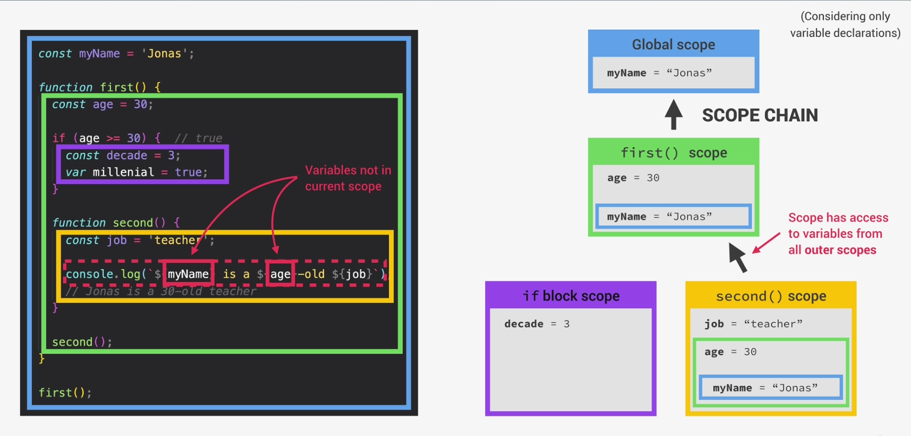

# Scope and The Scope Chain

Scoping in programming is basically finding the answer to "Where does this variable live?" or "From where can we access certain variable and where not?"

### Scope
It is a space or an environment in which certain variable is declared. 
Scope of a variable is the region of our code where a certain variable can be accessed. 

### Lexical Scoping
Scoping is controlled by the placement of the functions and the blocks in the code.

##  Types of Scope
There are **three** types of scope. They are: Global, Function, Block.

#### Global Scope : 
Variables declared in global scope are accessible anywhere.

#### Function Scope :
Variables declared in this scope are only accessible inside a function. It is also called local scope.

#### Block Scope:
Basically, a block is everything inside paired curly braces. Variables declared in this scope are only accessible inside the block. Functions are also block scope while using strict mode in JS.

## Scope Chain
Every scope always has access to all the variables from all its outer scopes. It is called scope chain.

## Variable Lookup
If a certain variable is needed in a scope and it is not found in there, the engine will look up in scope chain and see if it can find a variable in one of the parent's scope. 

*Scope chain has nothing to do with the order in which functions are called unlike Call Stack.*