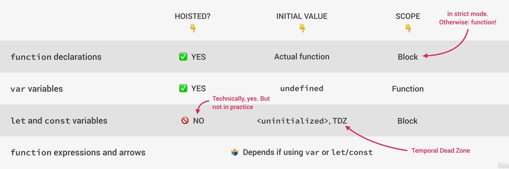
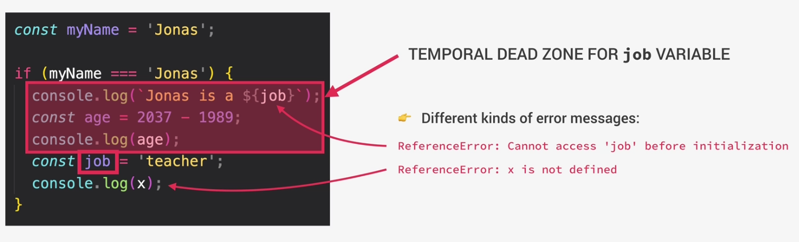

# Variable Environment: Hoisting and TDZ in JS

## Hoisting in JS:
Before execution in JavaScript, the code is scanned for variable declarations and for each variable, a new property is created in the variable environment object.

## Temporal Dead Zone(TDZ)
When you declare a variable using let or const, it creates a "zone" in your code called the Temporal Dead Zone. During this zone, if you try to access the variable before it has been declared, JavaScript will throw a reference error.

### Why TDZ?
- Prevents accidental variable usage
- Promotes better coding practices
- Enhances predictability
- Encourages block scoping
- Aligns with ECMAScript specifications

### Why Hoisting?
- It supports function expressions, enabling the use of functions before their actual declaration.

- Hoisting ensures variables and functions are available throughout the scope, regardless of their position in the code.

- It supports top-down code execution, maintaining the logical flow of the program.
 
- Hoisting allows for flexible code organization by declaring variables and functions where they conceptually make the most sense.

- It prevents ReferenceErrors by processing all declarations before executing any code.

- Hoisting simplifies coding practices by allowing declarations closer to their usage.

