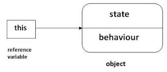

# This Keyword

It is a special keyword that refers to the context or scope in which a function is executed.



It is created for every execution context. It takes value of the "owner" of the function in which the this keyword is used.

"This" is not static. It depends on how the function is called, & the value is assigned when the function is actually called.

```
this  = <object that is calling the method.>
```

```
Example

const James = {
    name: 'James';
    year: '1995';
    calcAge: function() {
        return 2037 - this.year;
    }
};
James.calcAge()
```
### This keyword in various cases :

`Simple function call:` 

This is undefined in strict mode, otherwise: window in browser.

`Arrow function:`
 ```
this = <this of surrounding function(lexical this)>
```
`Event Listener:`

```
this = <DOM element that the handler is attached to>
```
`new, call, apply, land`

```
Practice: 

console.log(this);

// In strict mode, in regular function call(without any object), this keyword will point to undefined.

const calcAge = function (birthYear) {
  console.log(2037 - birthYear);
  console.log(this);
};
calcAge(1991);

//Arrow function doesn't get to use this keyword but uses lexical this keyword which is its parent or nearby object.

const calcAgeArrow = birthYear => {
  console.log(2037 - birthYear);
  console.log(this);
};
calcAgeArrow(1991);

const Jay = {
  year: 1981,
  calcAge: function () {
    console.log(this);
    console.log(2023 - this.year);
  },
};
Jay.calcAge();

//Even if the calcAge is defined in Jay it gets called through Mala using this:

const Mala = {
  year: 2017,
};
Mala.calcAge = Jay.calcAge;
Mala.calcAge;

//result here is not attached to any object, hence its just a regular function call and the this keyword does not work.

const result = Jay.calcAge;
result();
```