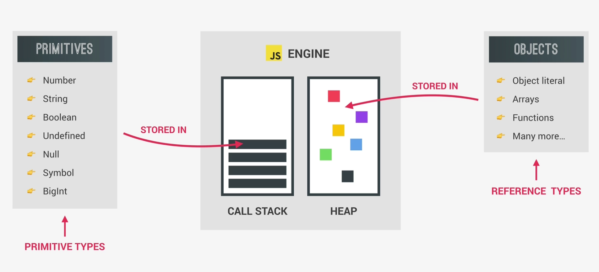
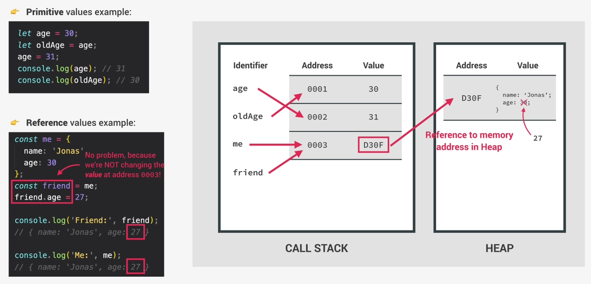

# Primitive Vs. Reference (Object) Types

#### Primitives:    
- Number
- String
- Boolean
- Undefined
- Null
- Symbol
- BigInt

 #### Objects:
 - Object Literals
 - Arrays
 - Functions
 and so on.

 

### Primitive Types (Stored in the Call Stack):

- Primitive types include numbers, booleans, strings, null, and undefined.

- When you create a variable with a primitive type, the actual value is stored directly in the variable itself.

- The variable with the primitive value is stored on the call stack.

- The memory allocation for primitive values is small and fixed, as they have a known size.

### Reference Types (Stored in the Heap with Reference in the Call Stack):

- Reference types include objects and arrays.
When you create a variable with a reference type, the variable stores a reference (address) to the object or array in memory, rather than the actual value itself.

- The object or array is stored in the heap, which is a larger region of memory used for dynamically allocated objects.

- The variable that holds the reference to the object or array is stored on the call stack.

- The size of reference types can vary depending on the complexity and size of the object or array.

- Multiple variables can hold references to the same object or array, allowing for shared access and modifications.

- When passing reference types as function arguments or assigning them to new variables, the reference is copied, not the actual object or array.

To summarize, primitive types are stored directly in variables on the call stack, while reference types are stored as references in variables on the call stack, with the actual objects or arrays residing in the heap. The call stack keeps track of the variables and function calls, whereas the heap is used for dynamically allocated objects and larger memory storage.

```
let age = 18;
let oldAge = age;
age = 19;
console.log(age);
console.log(oldAge);

const me = {
  name: 'Sarika',
  age : 19,
};

const friend = me;
friend.age = 20;
console.log('Friends:', friend);
console.log('Me', me);
```

