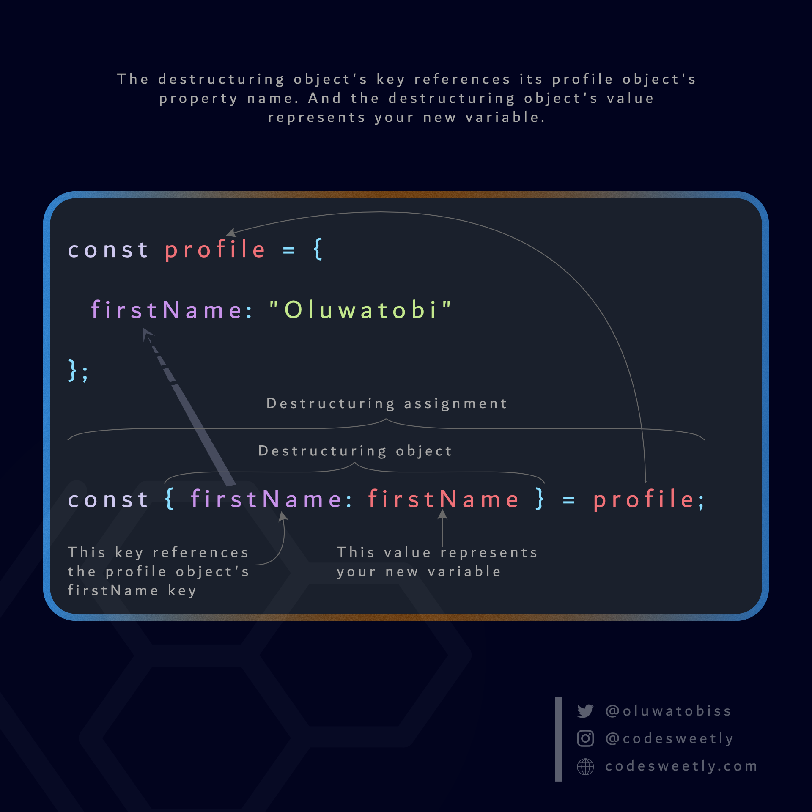

# Object Destructuring in JavaScript

Object destructuring is a feature introduced in ECMAScript 6 (ES6) that allows you to extract properties from objects and bind them to variables.

It provides a concise syntax for extracting values from objects and arrays, making your code more readable and expressive.

Object destructuring is particularly useful when working with function parameters. Instead of passing an entire object to a function, you can destructure the necessary properties directly in the function signature.



### Why is Object Destructuring necessary?
- Concise Syntax: Object destructuring allows you to extract and assign object properties in a single line of code, making your code more readable and compact.

- Readability: By explicitly listing the properties you are interested in, object destructuring makes your code more self-explanatory and easier to understand.

- Variable Assignment: Destructuring simplifies the assignment of object properties to variables, eliminating the need for manual property access using dot notation or square brackets.

- Function Parameter Handling: It enables you to extract specific properties from an object directly in the function signature, reducing the need to pass entire objects as function arguments.

- Default Values: Destructuring supports the assignment of default values to properties, ensuring that variables have a fallback value if the properties are missing or undefined.

- Nesting and Renaming: It allows for extracting properties from nested objects and assigning them to variables. Additionally, you can rename properties during the destructuring process, providing more flexibility in handling object data.

**Example**
```
// Object with properties
const person = {
  name: 'John',
  age: 25,
  country: 'USA'
};

// Destructuring assignment
const { name, age, country } = person;

console.log(name);    // Output: John
console.log(age);     // Output: 25
console.log(country); // Output: USA

```
In this example, we have an object called person with properties such as name, age, and country. Using object destructuring, we extract these properties from the person object and assign them to variables of the same name (name, age, and country). Finally, we log the values of these variables, which output the corresponding values from the object.