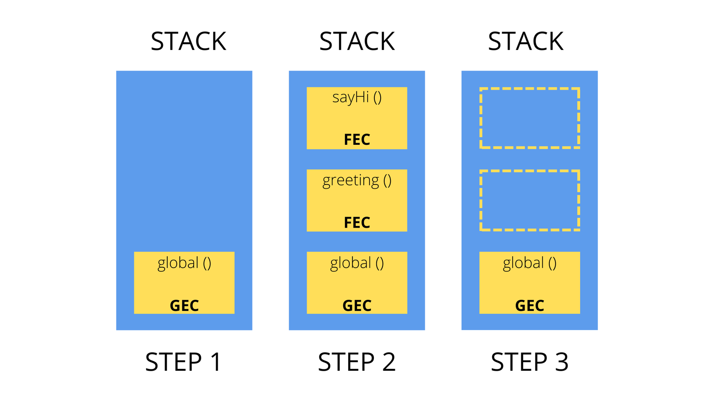

# Execution Contexts & The Call Stack

Today I dived deeper into what happens to the JS codes I have written after it is compiled. 

```
Compilation --> creation of global execution context (for top level code) --> execution of top-level-code --> execution of functions and waiting for callbacks
```
## What is Execution Contexts(EC) ?
It is basically an environment in which a piece of JS is executed. It stores all the necessary information for some code to be executed.

Every JS program I write is certain to have exactly one global EC. 

## What is inside an Execution Context ?
There is:

**1. Variable Environment**

 - let,const, var declarations
 - functions
 - arguments objects

**2. Scope Chain**
- contains references to the variables that are located outside of the current function; to keep track of scope chains; it is stored in each EC.

**3. this keyword**
- the "this" keyword refers to the context within which a function is executed. It allows you to access and manipulate properties and methods of the current object or the object that called the function.

> *Note: EC belonging to arrow functions do not get arguments objects and the this keyword.*

## What is Call Stack ?
Let's call it a place where ECs get stacked on top of each-other, to keep track of where we are in the execution.



The running EC is the top of stack and it gets popped off the stack, once its job gets done. 