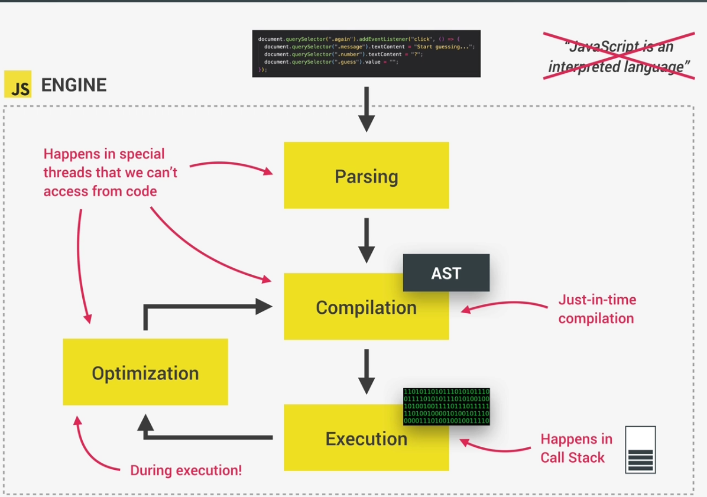

# The JS Engine and Runtime

JavaScript (JS) engines are software programs that execute JavaScript code.

They are responsible for interpreting and running JavaScript code in various applications, including web browsers, server-side environments, and command-line tools.

The most popular JS engine is V8Engine used in Chrome and NodeJS.

## Components of JS Engines
The **call stack** and the **heap** are two important components that handle memory and execution flow within the application

- Call Stack:
The call stack is a data structure that keeps track of function calls in the JavaScript program. This is where our code gets executed.

- Heap:
The heap is the memory region where objects and variables are allocated dynamically.

## How is the JS Code compiled?
Compilation in CS is where we convert our code to machine codes at once and execute it.

Interpretation in CS is process where source code is converted to machine code one line at a time. Previously, JS used to be an interpreted language.

But in modern JS, we have Just-in time(JIT) compilation, it is a technique used by JavaScript engines to dynamically optimize and compile JavaScript code during runtime.

## Insides of running JS code

# JS Runtime

JavaScript (JS) runtime refers to the environment where JavaScript code is executed. It provides the necessary infrastructure and services for executing JavaScript code, including memory management, event handling, and interaction with the host environment (e.g., web browser or server).